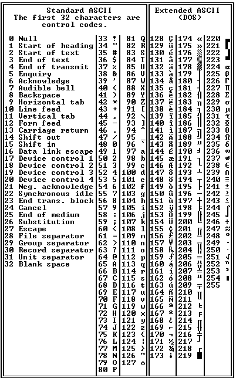
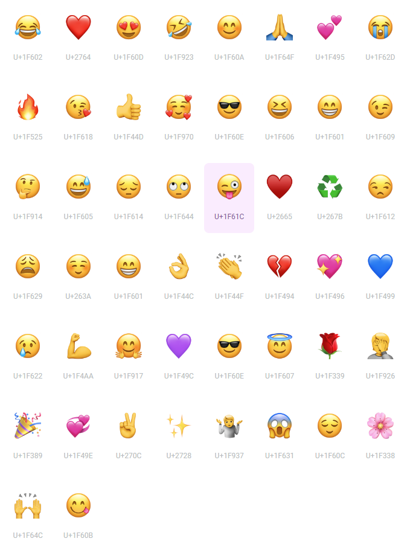
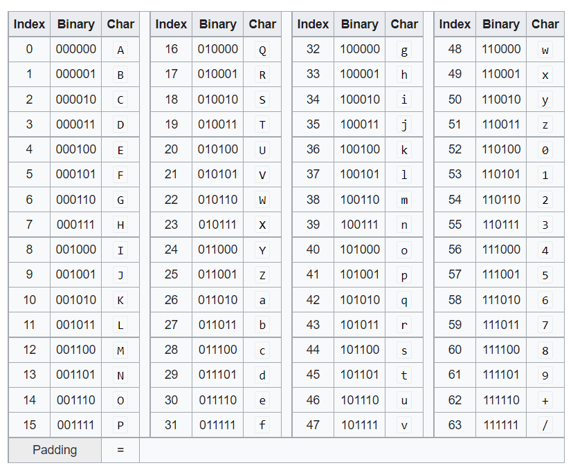
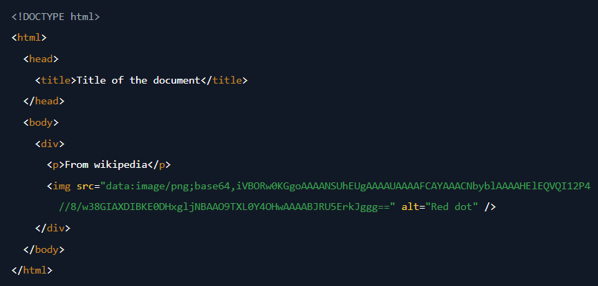

# [Cryptography] Encoding
*Learn about encoding, a way to reformat information.*

# Objectives
- ASCII
- Unicode
- Base64

# Introduction
Encoding refers to converting information into a specific form. Although encoding and encryption may sound similar, these two terms should not be confused. Encryption refers to converting information into a different form in order to keep information secret, such that decryption would be difficult without special knowledge. Encoding also converts information, but makes no attempt to prevent other people from obtaining the original message. In fact, encoding and decoding are simply opposite processes. Encoding is primarily used to ensure efficient transmission or storage of information. 

The most common types of encoding include ASCII, unicode, and base64. A tool called [CyberChef](https://gchq.github.io/CyberChef/) can be useful for encoding and decoding messages. 

1. ASCII
2. Unicode 
3. Base64

# Lesson
## ASCII
ASCII stands for American Standard Code for Information Interchange, and is a character encoding standard. Characters that can be encoded include uppercase letters, lowercase letters, digits, and many punctuation marks. The standard ASCII table includes 128 encoded characters using a 7-bit binary code. There is also an extended ASCII table (the modern standard) that includes 256 characters, which is the max number of characters that can be encoded with an 8-bit binary code. The table below shows both the basic and extended ASCII tables. 

In the table above, the numbers 0 through 127 represent all of the standard ASCII characters, and the numbers 128 through 255 represent all of the extended ASCII characters. The numbers 0 through 255 are displayed in decimal form, which can then be converted to binary or hexadecimal form. 

For example, if we want to encode the message **"Hi"** in ASCII in binary form, we would first look up the decimal representation of the uppdercase letter **"H"**, which is **72**, and the decimal representation of the lowercase letter **"i"**, which is **105**. We would then convert **72** and **105** to binary, which would get us the ASCII encoded message of **"1001000 1101001"**. 

We can repeat the same task using [CyberChef](https://gchq.github.io/CyberChef/). Below, the receipt takes the ASCII input of **"Hi"** and converts it into the ASCII encoded message in binary form. The output is the same as the manual encoding from before. 

We can also use CyberChef to decode the binary message **"1001000 1101001"** into an ASCII message, which reveals the original message **"Hi"**. 

## Unicode
Unicode is a standard for encoding which defines 144,697 characters, including those of modern and historical languages, emojis, and formatting codes. There are three main encoding forms in Unicode called UTF-8, UTF-16, and UTF-32. The numbers represent the number of bits needed per encoded character, meaning that it takes less memory to store UTF-8 encoded characters than UTF-32 encoded characters. UTF-8 is commonly used for HTML, and shares similarities with 8-bit ASCII. The following image shows how the top 50 emojis are encoded. 

The website [Unicode Character Table](https://unicode-table.com/en/) allows you to look up common sets of unicode encodings or search for individual characters. 

For example, one of the top 50 emojis is the **Face with Tears of Joy** emoji. Looking at https://unicode-table.com/en/1F602/ shows a lot of additional information about encoding of this emoji. In the table below, it can be seen that the UTF-8 encoding of this emoji is **11110000 10011111 10011000 10000010**. 

Using CyberChef, we can then decode this back into the original emoji. 

## Base64
Base64 is an encoding scheme that is commonly used to represent binary data in ASCII text. 64 unique ASCII characters were selected to represent binary data. Characters that are printable and common in most encoding systems were chosen because it is less likely that these characters would be modified while these characters are being sent and received. The following table shows the 64 chosen characters. 

 

Binary data is interpreted in groups of three 8-bit bytes, and each group is then converted into four 6-bit base64 characters. If the last group of binary data is too small, it is padded with 0's. Then, **=** is added as padding to complete the four 6-bit character set.

### Base64 Encoding Example
As an example, we will encode the following binary representation:  

**01001000 01100101 01101100 01101100 01101111**

First, group the binary data into groups of three 8-bit bytes. It is seen that we can make 1 group (shown in paranthesis) of three 8-bit bytes, and then have some binary data leftover. 

**(01001000 01100101 01101100) 01101100 01101111**

For each complete group, re-group the binary data into four 6-bit characters. For the leftover data, form groups of 6-bit characters, and fill in any remaining spots with 0's. In this example, the last group would have been 1111, so we add two 0's. 

**(010010 000110 010101 101100) (011011 000110 111100)**

Now, using the base64 character set chart, we can look up the characters that are represented by each of these 6-bit characters. The spacing is removed, giving us the following text. 

**SGVs bG8**

Since the last group only had three 6-bit groups, we add 1 **=** as padding to make it a complete set of four 6-bit base64 characters, giving a final base64 representation shown below. 

**SGVsbG8=**

### Base64 Encoding and Decoding with CyberChef
Although base64 is commonly used for encoding binary data into ASCII text, it is also used to encode other character based messages into ASCII text as well. For example, if you want to base64 encode the message **"base64 encoding!"**, that message would first be encoded into binary using ASCII encoding, and then base64 encoded using the process previously described. The image below shows the message base64 encoded using CyberChef. 

 

The image below then shows the base64 encoded message from the previous step getting decoded using CyberChef. 

 

# The Real World, Prolific Breaches
Base64 encoding and decoding is commonly used in web applications. For example, an image can be encoded with base64, and then embedded in HTML. Looking at the sample code snippet below, you can see a string of characters that looks like it is encoded with base64. Notice that the string ends with **==**, which is often a characteristic of base64 encoded characters.  

 

The above code snippet uses the **img** tag in HTML to embed the picture that is encoded with base64. 

# Check YoSelf
## Q1 - Use base64 to encode the word **cyber** using CyberChef (or manually for an extra challenge). 
a. Y3liZXI= <---  

## Q2 - Encode the word **bot** using 8-bit ASCII with CyberChef (or manually for an extra challenge). 
a. 01100010 01101111 01110100 <--- 

## Q3 - What is the unicode number of the latin capital letter B?
a. U+0042 <---  

# Keep Going, Next Steps
Check out the following curated resources if you'd like to keep learning about this topic to dominate hard challenges.
1. CyberChef  - https://gchq.github.io/CyberChef/
2. Video about ASCII and Unicode - https://www.youtube.com/watch?v=5aJKKgSEUnY
3. Video about Base64 - https://www.youtube.com/watch?v=8qkxeZmKmOY
4. Base64 Encoding by Hand - https://pthree.org/2011/04/06/convert-text-to-base-64-by-hand/
5. Base64 Encoded Images in HTML - https://www.w3docs.com/snippets/html/how-to-display-base64-images-in-html.html
6. Character Encoding - https://www.w3.org/International/questions/qa-what-is-encoding
7. Why do emojis look different on different devices? - https://slate.com/human-interest/2016/02/emojis-on-apple-google-samsung-can-look-very-different-from-each-other-video.html
