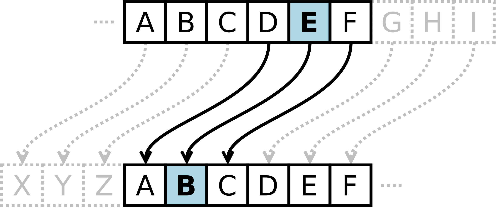
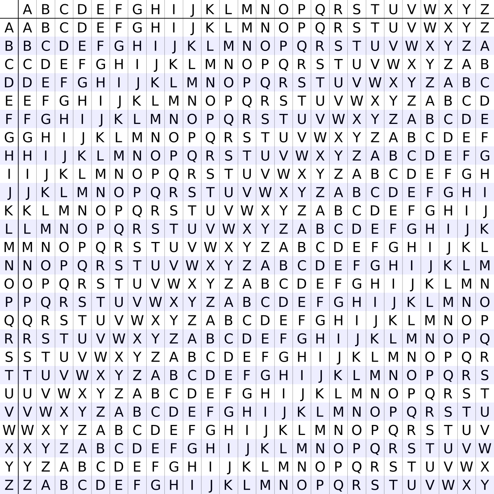
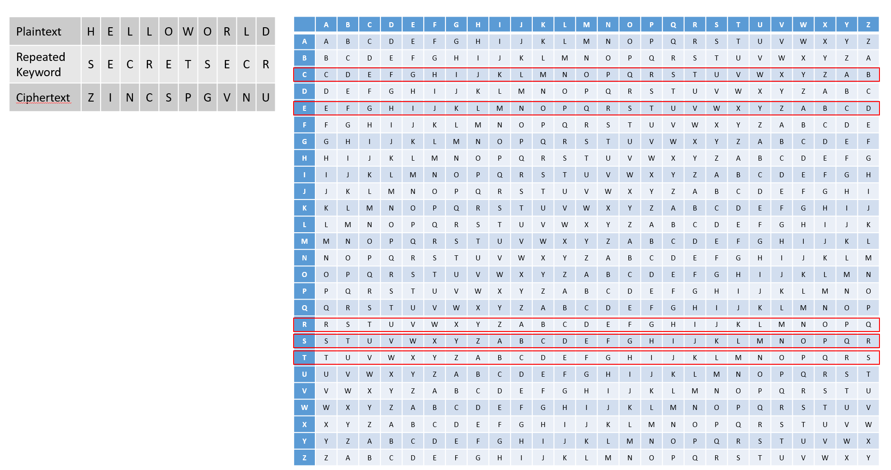

# [Cryptography] Primitive Cryptosystems
*Learn about early cryptography including morse code, Caesarean cipher, Vigenere cipher, and XOR cipher.*

# Objectives
- morse code 
- Caesarean cipher (shift cipher)
- Vigenere cipher
- XOR cipher
- cyberchef

# Introduction
Do you remember sending secret notes as a kid? Maybe you had a disappearing ink pen to write secret notes to your friend, or maybe you made up your own secret language. People have developed numerous methods of sending secret messages throughout history. Cryptosystems are designed so that two people can exchange a message that only they can understand. Anyone who intercepts the message would just see gibberish. Although the early cryptography systems we will discuss here are no longer used due to being insecure, they paved the way to the modern cryptosystems in use today. 

1. Introduction to Crytography Terms
2. Morse Code
3. Caesarean Cipher (Shift Cipher)
4. Vigenere Cipher 
5. XOR Cipher
6. CyberChef

# Lesson

## Introduction to Crytography Terms
Cryptography is about sending a message to a recipient in a way that the recipient can understand the message, but someone intercepting the message would not be able to understand the message. The original message is called **plaintext**. In order to make this plaintext message secret to anyone spying on the message, it is encrypted into **ciphertext**, which looks like gibberish to anyone who doesn't know how the plaintext was encrypted. The sender and receiver of the message both agree on a method of encryption prior to sending messages back and forth. This way, they each know how to encrypt and decrypt messages. When the recipient receives the ciphertext message, they will already know how to decrypt the message back into plaintext based on the previously agreed method of encryption and decryption. Different kinds of cryptography exist due to different methods of encryption and decryption. 

## Morse Code
Morse code is a method of encoding a message. Morse code doesn't offer any secrecy, and so it would be considered an encoding as opposed to a cryptosystem. It was simply designed for ease of transmitting the message. 

In Morse code, text characters are converted to a standardized sequences of dots and dashes, also called dits and dahs. Below is a chart of how letters and numbers encoded. 

The dots and dashes represent different amounts of time, where the dit (dot) duration is the basic unit of time. The dah (dash) duration is three times the dit duration. After each dit or dah, there is a period of silence that is the same duration as the dit duration. To signal the end of a letter, there is a period of silence that is the duration of 3 dits. To signal the end of a word, there is a period of silence that is the duration of 7 dits. 

Morse code was useful because it could be transmitted either by sound or by light. People memorized the sounds or sights of each letter and number, and could send and receive messages through either method. Morse code was commonly used for radio communication before voice could be transmitted, and was used for communications during World War II. 

## Caesarean Cipher (Shift Cipher)
The Ceasarean cipher has many names, including Caesar cipher, shift cipher, ROT13, Caesar's code, and Caesar shift. This cipher is one of the simplest encryption techniques. Each letter in the alphabet is encrypted by replacing it with a letter that is a fixed number of positions down the alphabet. For example, if there were a right shift of 2, the letter A would be encrypted as C, the letter B would be encrypted as D, and so on. 

The following image shows how a left shift of 3 would work, where the top row of letters is the original text, and the bottom row of letters is the encrypted text. This shift would occur for every letter of the alphabet. 

In order to encrypt a message using the Caesarean cipher, a right or left shift of a specific value would first be selected, and each letter would be encrypted using the selected shift amount. The Caesarean cipher is especially interesting because it is often used in more complex encryption schemes, such as the Vigenere cipher. 

There is a similar type of cipher called a substitution cipher, where each letter in the alphabet is replaced by another letter in the alphabet, but does not need to follow any order. A Caesarean cipher is a type of substitution cipher, but a subsitution cipher is not a type of Caesarean cipher. 

## Vigenere Cipher 
The Vigenere cipher is a type of substitution cipher that uses a keyword along with a series of Caeserean ciphers. To encrypt a message, a Vigenere table is used, which has the alphabet written 26 times, where each row of the alphabet is shifted to one of the 26 possible Caesarean ciphers. Below is an image of a Vigenere table. 

A secret keyword is chosen, and then repeated until it matches the length of the plaintext. Each letter of the plaintext will be encrypted using the row of the Vigenere table that corresponds to the letter of the secret keyword. Thus, if the keyword is 5 letters long, a maximum of 5 different Caesarean ciphers are used to encrypt the plaintext message. In the example below, the plaintext "HELLO" is encrypted using the keyword "SECRET". Because "SECRET" has the letter "E" repeated twice, only 5 different Caesarean ciphers are used to encrypt the plaintext message. 

## XOR Cipher

A XOR cipher uses the XOR operation to encrypt messages. It is a type of symmetric encryption, where the same key is used to encrypt and decrypt a message. 

First, characters are converted to 8-bit binary using ASCII encoding. Then, a long key that does not repeat itself is chosen. This key should consist of 0's and 1's and should be as long as the message that is being encrypted. 

In the sample below, we will encrypt the the plaintext message using the key shown in the 2nd row. The XOR operation is performed on the plaintext and key to create the ciphertext. 

|Plaintext  |0|1|0|0|1|1|1|0|
|Key        |0|1|1|0|0|0|1|1|
|Ciphertext |0|0|1|0|1|1|0|1|

Someone with the key and the ciphertext will then be able to decrypt the message. To decrypt a message, the XOR operation is performed on the ciphertext and key to retrieve the plaintext. 

## CyberChef

A tool called [CyberChef](https://gchq.github.io/CyberChef/) is an online web application that allows many cryptography operations. It can manipulate messages by encoding, decoding, encrypting, decrypting, and much more. In the menu on the left, many categories of operations are visible. Under the Encryption/Encoding category, there are options such as To Morse Code, From Morse Code, Substitute, Vigenere Encode, Vigenere Decode, XOR, and XOR Brute Force. These options are used for the previously covered cryptosystems in this lesson. 

For example, if you use the "To Morse Code" option and put in an input of "hello world", the output shows ".... . .-.. .-.. --- 
.-- --- .-. .-.. -..". There are options to change the "Letter delimiter" and "Word delimiter", which slightly changes how the output is shown compared to the rules previously discussed for Morse code. 

[CyberChef Example - To Morse Code](https://gchq.github.io/CyberChef/#recipe=To_Morse_Code('-/.','Space','Line%20feed')&input=aGVsbG8gd29ybGQ)

# The Real World, Prolific Breaches

## Cracking a Caesarean Cipher (or Substitution Cipher)
Since there are only 26 possible Caesarean ciphers, the quickest way to crack a message encrypted with a Caesarean cipher is to simply decrypt the ciphertext message with each of the 26 possible ciphers. You can quickly see which of them is the real message, since 25 of them will look like gibberish. 

Subsitution ciphers can also potentially be cracked, depending on the length of the message. The English language has certain letter frequencies and letter combination frequencies when messages are of sufficient length. For example, the letter E is the most common letter, so it may be a good assumption that the most common letter in the ciphertext is E in plaintext. Other techniques such as looking for single letter words might help since the most common single letter words are "a" and "I". Looking for other short common words such as "of", "in", "and", "the", and so on may also give some clues to what ciphertext letters stand for. The English language also tends to have some common double letter patterns such as "ll", "ee", "ss", and more. By making educated guesses in a longer message, it may be possible to decipher what the original plaintext message was. This type of analysis is called frequency analysis, where common letters and patterns in the English language are analzyed. 

## Cracking a Vigenere Cipher
The original goal of using a Vigenere cipher was to prevent the use of frequency analysis to decipher a message. However, since a Vigenere cipher uses a repeating key, if someone could correctly guess the key's length, this information can be used to break each Caeserean cipher inndividually using the methods described in the last section. You might be thinking, "What if I just used a realy long key?". If a key as long as the plaintext message were used, this would actually be called a one-time pad, which is theoretically unbreakable. However, this would require two people to have previously shared this very long secret key before sending any messages. 

## Cracking a XOR Cipher
Similar to the flaws of the Vigenere cipher, XOR ciphers can be broken using frequency analysis if a repeating key is used. Likewise, if a key as long as the plaintext message is used, this is called a one-time pad, which is theoretically unbreakable. Although the XOR cipher may not appear to be much stronger than other ciphers, it is often used in cryptography because it results in "perfectly balanced" ciphertext. For a plaintext input of 0 or 1, it results in ciphertext results that are equally likely to be 0 or 1. 

# Conclusion

# Check YoSelf
## Q1 - Decrypt the following ciphertext that was encrypted with a Caesarean cipher with a right shift of 5: "LIPPS XLIVI". 
a. HELLO THERE <--- 
b. HIPPO ALIVE  
c. CAESAR SHIFT  

## Q2 - Decrypt the following ciphertext that was encrypted with a Vigenere cipher and secret keyword **secret**: "hiceym tyvkik"?
a. Vigenere cipher is more complicated  
b. peanut butter <--- 
c. secret phrase  

## Q3 - Decrypt the folloowing ciphertext that was encrypted with a XOR cipher where the key length is 1: "kj#wkfqf"?
a. hi there <--- 
b. magical  
c. an apple  

# Keep Going, Next Steps
Check out the following curated resources if you'd like to keep learning about this topic to dominate hard challenges.
1. CyberChef Tool  - https://gchq.github.io/CyberChef/
2. Morse Code History Video - https://www.youtube.com/watch?v=iy8BaMs_JuI
3. Caeser Cipher Video - https://www.youtube.com/watch?v=sMOZf4GN3oc
4. Vigenere Cipher Video - https://www.youtube.com/watch?v=SkJcmCaHqS0
5. XOR Security - https://idafchev.github.io/crypto/2017/04/13/crypto_part1.html
6. XOR Cipher Video - https://www.youtube.com/watch?v=pvII6_O6KAc
