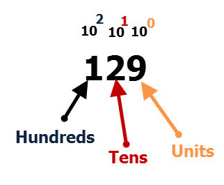
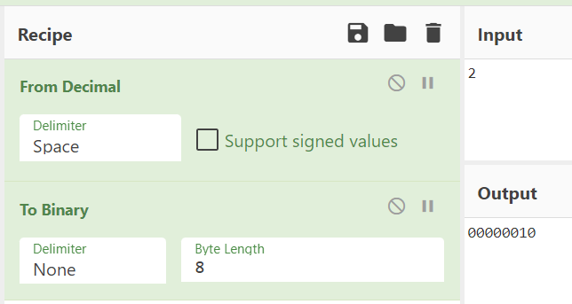
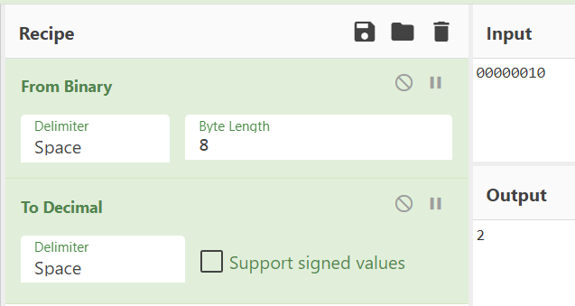
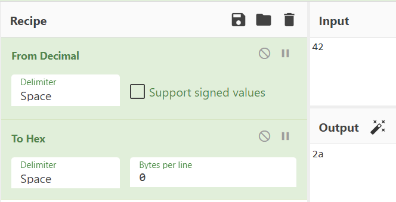
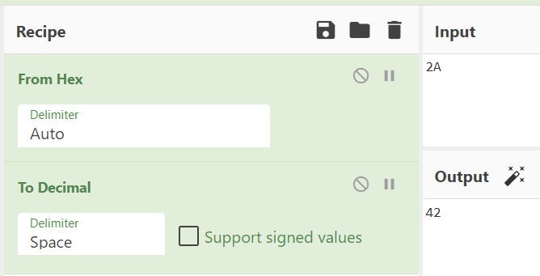

# [Cryptography] Learn to Count
*Learn about why there are different number systems.*

# Objectives
- Understand the basic mathematical mechanisms of the following number systems: decimal, binary, hexadecimal
- Learn how to convert numbers between the above number systems. 

# Introduction
When we think of numbers, we are usually thinking about the decimal number system. This system that we are used to uses 10 as a base, and the digits range from 0 to 9 (total of 10 digits). There are also other number systems, such as binary and hexadecimal. 

The binary number system uses 2 as a base, and the digits range from 0 to 1 (total of 2 digits). For example, the decimal number 42 would be 0b101010 in binary. The **0b** at the beginning of the number indicates that it is a binary number. This is to help distinguish between decimal numbers and binary numbers. 

The hexadecimal number system uses 16 as a base, and the digits range from 0 to 9, and then A-F (total of 16 digits). For example, the decimal number 42 would be 0x2A in hexadicimal. The **0x** at the beginning of the number indicates that it is a hexadecimal number. This is to help distinguish between decimal numbers and hexadecimal numbers. 

In this lesson, we will cover the following 3 decimal number systems, and why they are important in computing and cybersecurity. 

1. Decimal
2. Binary
3. Hexadecimal

# Lesson
## Decimal

When we first learn to count and learn simple mathematics, we use the decimal number system. We first counted with digits 0 to 9, and then learned about what to do with overflowing digits into another column. For example, the decimal number 129 can be broken down into the units, tens, and hundreds places. In the image below, you can see each place being broken down into powers of 10 at the top to represent each column. 

129 is the same as 100 + 20 + 9, which can be derived from the top representation of each column and the number in each place. Broken down further, 129 can be represented as 1*10^2 + 2*10^1 + 9*10^0. Any decimal number can be broken down in this method. Notice that every column represents a power of 10, which is why we say that the decimal number system uses 10 as a base. 

The decimal number system is commonly used in many fields, and is the number system that humans understand the best. However, many computer applications use other number systems such as binary and hexadecimal. 

## Binary
At the lowest levels of the computer, everything is represented by an eletric signal that is either on or off. This can be represented with binary numbers where **1** means **ON** and **0** means **OFF**. In order for the computer to intrepret more complicated data, the computer must encode it into binary data. 

The binary number system uses 2 as a base, but the values can be calculated in the same way that decimal numbers are calculated. 

### Binary to Decimal Conversion
For example, if we want to breakdown the binary number 0b10110, we can re-write the number as follows to convert it to a decimal number:

0b10110 = 1*(2^4) + 0*(2^3) + 1*(2^2) + 1*(2^1) + 0*(2^0) = 8 + 0 + 4 + 2 + 0 = 14

### Decimal to Binary Conversion
You can also perform the opposite calculate to convert a decimal number to a binary number. In the image below, the decimal number 15 is converted to a binary number. 

Start by writing out the values for all the powers of two from the right-most digit (2^0) until you write down a number that is larger than the number you are trying to convert. From there it can be deduced that the next biggest place will be used to create the binary number. Here, we see that 16 is greater than 15, so this the final binary number will be 4 digits long. From here, you would add up 8 + 4 + 2 + 1 to get 15, so each of the 4 digits will be 1. 

There are also numerous tools that convert binary numbers to decimal numbers, and vice versa. For example, [CyberChef](https://gchq.github.io/CyberChef/) can be used to calculate between binary and decimal numbers. In the examples below, CyberChef is used to convert between binary and decimal numbers.

## Hexadecimal
The hexadecimal number system uses 16 as a base, and has 16 digits represented by 0-9 and A-F. The following table shows all of the hexadecimal digits converted to decimal numbers.

|Hexadecimal|Decimal|
|----|----|
|0|0|
|1|1|
|2|2|
|3|3|
|4|4|
|5|5|
|6|6|
|7|7|
|8|8|
|9|9|
|A|10|
|B|11|
|C|12|
|D|13|
|E|14|
|F|15|

There is no standard on whether the A-F digits are lowercase or uppercase, so you may see both representations. For example, you may see 0xA4B, 0xA4b, or 0xa4b. 

Hexadecimal numbers are often used because it is more human-friendly than binary numbers. Each hexadecimal digit can be used to represent four bits (or four binary digits). One common use case is using hexadecimal numbers from 0x00 to 0xFF to represent an 8-bit byte with values ranging from 0b00000000 to 0b11111111. This also saves many digits, as it only takes 2 hexadecimal digits to express decimal numbers from 0 to 255, whereas it would take 8 digits in binary. 

Using CyberChef, we can convert between hexadecimal numbers and decimal numbers. Shown below are examples of both conversions.

# The Real World, Prolific Breaches
Many spam emails include links to hacker controlled malicious websites. However, many email services also use email filters to prevent malicious links from landing in users' inboxes. Usually, you would see URL's in the form of https://www.google.com. However, this actually points to an IP address, which typically look something like 192.168.0.1. An IP address can also be represented in other forms, such as hexadecimal, where each decimal number is converted to hexadecimal. Thus, http://192.168.0.1 would look like http://0xc0a80001 in hexadecimal. In this attack, the hackers were able to send emails with malicious URL's that look like http://0xc0a80001 in order to bypass email filtering systems. 

# Check YoSelf
## Q1 - Which number system would be most useful when working with hardware that receives electrical signals that are either on or off? 
a. Decimal  
b. Binary <---  
c. Hexadecimal  
d. None of the above  

## Q2 - What is the largest decimal number that can be represented by two digits of a hexadecimal number?  
a. 0  
b. 99  
c. FF  
d. 255 <---  

## Q3 - What is the largest decimal number that can be represented with 4 bits of binary data? 
a. 0  
b. 10  
c. 15 <---  
d. 16  

# Keep Going, Next Steps
Check out the following curated resources if you'd like to keep learning about this topic to dominate hard challenges.

1. CyberChef - https://gchq.github.io/CyberChef/
2. Binary Number System - https://www.youtube.com/watch?v=sXxwr66Y79Y
3. Convert Between Hexadecimal and Decimal - https://learn.sparkfun.com/tutorials/hexadecimal/converting-tofrom-decimal
4. Spammers use Hexadecimal IP Addresses to Evade Detection - https://www.zdnet.com/article/spammers-use-hexadecimal-ip-addresses-to-evade-detection/
5. CyberChef Data Representation - https://cybergibbons.com/reverse-engineering-2/understanding-binary-and-data-representation-with-cyberchef/
