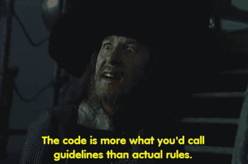

# [Miscellaneous] How To Not Get Arrested
A lesson in ethics in computer security

# Objectives
* Understand why you should behave ethically in the field of offensive security
* Understand how to ethical behavior in the field of offensive security.

# Introduction
**Disclaimer** - this article does not constitute actual legal advice. 

Here at Hack a Bit, our aim is to teach you to become a good hacker.
1. Be good. And hack things.
2. Be good at hacking things.

---
When people think of hackers, they often think of something like this:

When hackers make the headlines, it's usually about some criminal organization breaching the systems of a large company or the government. 

Many people question why. The best security people know how to think like an attacker. Before we begin with , we'll take a quick look at what it means to be an ethical hacker.

# Lesson
## Terminology
* White-hat hacker - someone who hacks with good intentions. *With permission*, white-hat hackers attack systems to identify vulnerabilities and help make to them more secure.
* Black-hat hacker - someone who hacks with malicious intention, usually engaging in criminal activity. 
* Gray-hat hacker - someone who hacks with good intentions but without permission or through ethically questionable methods.

## Reasons to Choose White-hat

1. You can probably make more money.

 Many white-hat hackers will work as security consultants or find employment by a company looking for security professionals. 

According to Glassdoor, the average security engineer can expect a salary of $111,000. On the upper end of compensation, C-suite level positions in major corporations (CIO, CISO) earn millions of dollars.

2. You can avoid going to jail. 
There are laws in the US that allow for the prosecution of cybercrime, most notably, the Computer Fraud and Abuse Act. 

### Examples of Cybercrime
* Identity theft
* Financial fraud
* blackmail
* ransomware/destruction of data
* adware/spam
* Leaking software/data
* Running botnets
* Piracy, Software cracks and other warez

## Rules to avoid Jail

We won't be discussing the specifics of the law, but if

1. Don't touch things that aren't yours - Never attempt to exploit a system that you haven't been given explicit permission by the system owners.

Here in Hack-a-Bit, you will be provided an environment where you can look 

2. Follow the rules - When performing a penetration test, be sure to have written Statement of Work (SoW) or Rules of Engagement (RoE) from the system owners with a well-defined scope. Systems that are not within the scope should not be tested.

3. Observe software licensing and EULA.

## Bug Bounty Programs
Many companies have begun offering bug bounty programs, where they give you permission to perform security assessments of their software and systems. Many will even pay you for doing so! **HackerOne**, **Bugcrowd**

## Responsible Disclosure
Even without a bug bounty program, it is still advisable to engage in responsible disclosure if you find a vulnerability in a system so that the issue can be fixed. 
 
How to responsibly disclose 
* Contact the system owners and provide relevant technical details on the vulnerability you found
* Give them time to fix the software
* Make sure patches are released before publicly releasing information about the exploits

# Conclusion

Ultimately, how you choose to wield your security skills will be your responsibility. We hope that you make good decisions along the way. Happy hacking! 😊  

---

# Extra Reading (Optional)
Interesting Case Studies
* https://arstechnica.com/tech-policy/2021/10/viewing-website-html-code-is-not-illegal-or-hacking-prof-tells-missouri-gov/
* https://www.wired.com/story/confessions-marcus-hutchins-hacker-who-saved-the-internet/

The Law
* https://en.wikipedia.org/wiki/Computer_Fraud_and_Abuse_Act
* https://www.wired.com/2015/10/cfaa-computer-fraud-abuse-act-most-controversial-computer-hacking-cases/
* https://www.triaxiomsecurity.com/rules-of-engagement-important-to-penetration-test/

Bug Bounty
* https://www.hackedu.com/blog/what-are-bug-bounty-programs-and-why-are-they-becoming-so-popular
* https://bughunters.google.com/about/rules/6625378258649088/google-and-alphabet-vulnerability-reward-program-vrp-rules
* https://www.pcmag.com/news/7-huge-bug-bounty-payouts

# References
* https://www.glassdoor.com/Salaries/security-engineer-salary-SRCH_KO0,17.htm
* https://www.wsj.com/articles/BL-CIOB-10356