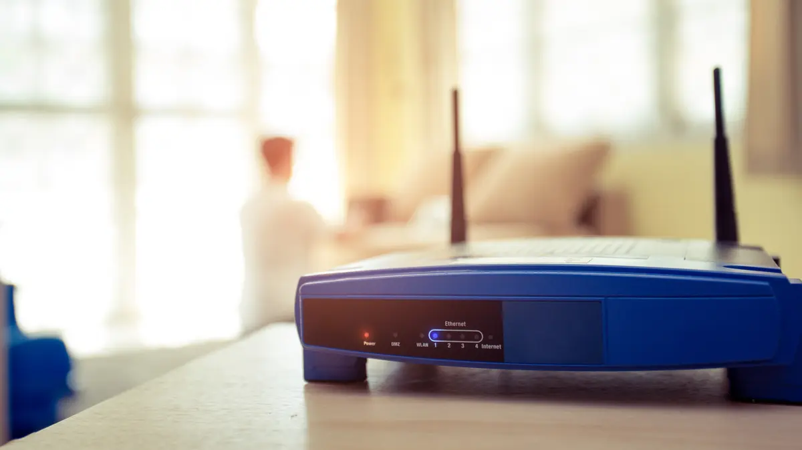

# [Networking] Hardware
*Understanding components of a common home router*



# Objectives
- Understand common components of a home router
- Learn network specific terminology
- Learn what components could be useful to solve connection requirements

# Introduction
A total of 5 billion people around the world use the internet today based on report from April 2022. Many people are familar with a device called a router that allows them to connect to the internet. Home routers exist in various different forms and in this lesson you will learn what they represent. 

1. [Home Router Components](#home-router-components)
2. [Switch](#switch)
3. [Router](#router)
4. [Broadband Connection](#broadband-connection)
5. [Wireless Access Point](#wireless-access-point)
6. [Firewall](#firewall)

# Lesson
## Home Router Components
Home routers typically contain following components:
* Switch (Ethernet LAN)
* Router (Ethernet WAN)
* Broadband Connection
* Wireless Access Point (Wi-Fi)
* Firewall 

It is important to note that these are typical components, but a router can have more or less depending on the specific application of the device. 


## Switch
Switches facilitate sharing of resources on a Local Area Network (LAN) including all of the computers, printers, and servers. All of the connected devices can share information and usually these are all of the devices you own and trust. Ethernet cables are used to connect devices on the network. 


## Router
Routers connect to an Internet Service Provider (ISP) which is part of the Wide Area Network (WAN). ISP connects various routers together so that they can all communicate. 

Depending on the ISP, various different forms broadband connections are used which is described in next section.

ISP networks contain routers just like home routers. The goal of the router is to direct traffic and choose the most efficient route to travel across the network including the internet. 


## Broadband Connection
Broadband connection refers to the high-speed internet access technology which the ISP provides. 

* Cable Modem
  * Cable modem service uses coaxial cables that deliver picture sand sound to TV.
* Digital Subscriber Line (DSL)
  * DSL service uses traditional copper telephone lines.
* Fiber
  * Fiber technology uses light to carry data through transparent glass fibers
* Wireless
  * Wireless service uses radio link between home location and nearest service provider facility
* Satellite
  * Satellite service is a type of wireless broadband, but the communication is with a satellite rather than a nearby facility

## Wireless Access Point
Wireless Access Point component of the router provides Wi-Fi access to all of the devies on your local network without the need for Ethernet cables. 

## Firewall 
Home routers also contain a firewall which appropriately protects devices on your LAN from devices on the internet. If you have ever played games on consoles, some of them require modification of the home router firewall in terms of allowing certain ports through or setting up port forwarding which allows devices on the internet to connect to the console on your local LAN. 

# Check YoSelf
## Q1 - What component connects devices on a Local Area Network?
a. ```firewall```<br>
b. ```connector```<br>
c. ```switch``` <---<br>
d. ```hat```<br>

## Q2 - What does WAN stand for?
a. ```World Wide Web```<br>
b. ```Wide Area Network``` <---<br>
c. ```Wireless Area Network```<br>
d. ```Work Authorization Net```<br>

## Q3 - Can a home router function without Ethernet LAN (switch)?
a. ```Yes```<---<br>
b. ```No```<br>

# Keep Going, Next Steps
Check out the following curated resources if you'd like to keep learning about this topic to dominate hard challenges.
1. Resource 1 - [What Is a Router](https://www.cisco.com/c/en/us/solutions/small-business/resource-center/networking/what-is-a-router.html)
2. Resource 2 - [Types of Broadband Connections](https://www.fcc.gov/general/types-broadband-connections)

