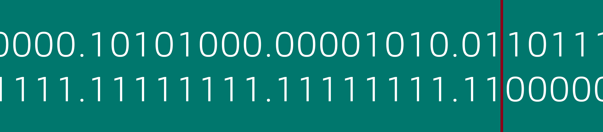

# [Networking] Subnetting
*If everyone's screaming in one room, you can't hear anyone.*



# Objectives
- Understand what a subnet mask is
- Understand why networks are segmented
- Understand when a router is required/when it's not

# Introduction
If you put everyone in a single room the room gets noisy quickly. Networks are like this as well. If you put all devices on one network, the devices will have to process alot of traffic. In a properly subnetted network, traffic can travel a shorter distance to reach its destination and less devices have to process data not intended for them. In this lesson we'll cover the difference between routing and switching, discuss classful as opposed to classless networks and finish with the calculations you need to know for the later. As a disclaimer: we will focus on IPv4 in this lesson as opposed to IPv6.

This stuff is hard and takes people years to wrap their heads around it sometimes; dont stress if it's taking you a minute.

1. [Routing v. Switching](#routing-v-switching)
2. [Classful and Classless Subnets](#classful-and-classless-subnets)
3. [CIDR and Classless](#cidr-and-classless)
4. [The Math and Lowest Levels](#the-math-and-lowest-levels)

# Lesson
## Routing v. Switching
Once you connect devices with a cable, there are generally either one or two steps required to send information to the target. If you are sending data on your local network, it's most common that you would be, "switching traffic." Consider that you live in a house with your parents and then your grandparents live in a different house. If you want to send a message to your parents you simply walk it over to them, this is like switching. It's generally local and broadly speaking, all the things you connect to the switch can talk to eachother immediately. 

In the other case, you want to send a message to your grandparents. Now we need to get the router involved, the mailman if you will. The mailman picks up your package and determines the fastest way to get it to your grandparents. This is routing. When we are within the house we do not care about routing, but when we leave the house we NEED routing.

This is a slightly higher-level explanation, but if you learn better from videos it might be more helpful:
<p align="center">
  <a href="https://www.youtube.com/watch?v=O5jAQwAN8mo">
    
  </a>
</p>

## Classful Subnets
Looking at the following ip address we see there are four sections, we call these octets and the way its written "dotted decimal notation." If you read the address it makes sense. The digits are decimal (base10) and they are seperated by a dot or period. ```192.168.3.1```. Now consider that we need to be able to say "what network we are on," as well as "what device we are, on that network." If two networks are the same then routers can't destinguish between two different houses. This would be like having two houses with the same address.

In classful networks, we use entire octets to describe the network and host. Remember that we only have four octets, so we can say that in the above address the network part of the address is either ```192``` or ```192.168``` or ```192.168.3``` whereas the hosts would respectively be either ```168.3.1``` or ```3.1``` or just ```1```. Lets look at classful network breakdowns quickly in the following table.

```192.168.3.1```

| Network   | Host    |
|-----------|---------|
| 192       | 168.3.1 |
| 192.168   | 3.1     |
| 192.168.3 | 1       |

Maybe you're wondering why we would slice things differently? The answer is that we might need to represent a different number of things. In the first example we can represent 256 different networks because we have one octet and 256 is the total possible combinations in one octet, from 0 -> 255. We have chosen the ```192``` network of the possible 256 networks. Now we can represent any host using the last three octets: ```192.x.x.x```. In the second example we have two octets so we can represent 256*256 possible network ids or 65,535 networks. In that case we have chosen the ```192.168``` network. If you want smaller newtorks you increase the number of octets used for the network and reduce the number used for the hosts. If you want bigger groups of hosts and a fewer number of networks then you allocate more octets to the host.

Now how do the computer and network devices know where to divide up the octets? We tell it using a subnet mask. In this case we mask the octets that are going to be used for the network with 255. So if we want to tell the devices that we are using the first three octets for the network and the last octet for the host, giving us 255^3 networks with 255 hosts on each network, we would use the subnet mask ```255.255.255.0```. If we want to use half the octets for network and half for hosts we would divide it like ```255.255.0.0```. Of course in the last case, if we want to say that the ```192``` part of the address is the network we would use the mask ```255.0.0.0```.

This whole scenerio is called "classful" subnetting because we are using the entire octet to represent parts of the network. The problem is that we only have a few configuration options. We can actually get more granular and divide the octets into halves or even more. This is called classless subnetting, but before we talk about how to actually do this, we need to exapand on the math and talk more about why octets range from 0-255.

## The Math and Lowest Levels
An octet is generally represented in base 10, decimal numbers. In the earlier section this is the "dotted decimal" representation used. Computers don't understand this, however. Computers understand base two, ie: ones and zeros. We call these one's and zero's "bits." **An octet is called an octet because it is 8 bits ie the prefix oct.**

To a computer the address 192.168.3.1 looks like: ```11000000101010000000001100000001```

| 192      | 168      | 3        | 1        |
|----------|----------|----------|----------|
| 11000000 | 10101000 | 00000011 | 00000001 |

A subnet mask "masks" the *network* bits. In the above example, if we want to use the first three octets for network then the mask would be ```255.255.255.0```. This breaks out to look like this for the device: ```1111111111111111111111110000000```

| 255      | 255      | 255      | 255      |
|----------|----------|----------|----------|
| 11111111 | 11111111 | 11111111 | 0        |

## CIDR and Classless
In the above example of a 255.255.255.0 subnet mask where the first three octets represent the network, there are 24 ones and 8 zeros. We can use a notation called CIDR, or "classless inter-domain routing" to annotate the mask rather than saying out the entire thing. CIDR is simply annotated as the number of ones in the address. So for this subnet mask we would use a slash and then write 24 for 24 bits on (1's). If we want to quickly represent the address with the mask we can write ```192.168.3.1/24```.

We've now talked about classful networks where entire octers are "on" or "off," but we can also split an octet and use any number of 1's for the network or host. We can use any value between ```/0``` and ```/32```. When we slice an octet rather than it being on or off, this is called a "classless" subnet. If you see a subnet mask where there are decimal numbers other than 255 or 0, the subnet is classless. Here is an example of a classless subnet mask.

### 192.168.45.21/26

#### IP Address (192.168.45.21)
| 192      | 168      | 45       | 21       |
|----------|----------|----------|----------|
| 11000000 | 10101000 | 00101101 | 00010101 |

#### Subnet Mask (255.255.255.192)
| 255      | 255      | 255      | 192      |
|----------|----------|----------|----------|
| 11111111 | 11111111 | 11111111 | 11000000 |

One final point is to look at how the mask works. There is a logical operation in a computer called an AND. If you provide an AND gate (0,0) (0,1) (1,0) it will return false, or 0. If you provide the gate 1,1 it returns a 1. Computers use AND logic to mask an address.

This looks like the following for the previous example:
<br>```Addr: 11000000101010000010110100 010101```
<br>```Mask: 11111111111111111111111111 000000```
<br>```Netw: 11000000101010000010110100 000000```

A space was added to show where the "network bits" stop and as you can see only the parts of the address that were masked were added to the network. This allows us to calculate the network id. If you want to go further with this consider how we would find the fist and last possible address in the subnet as well as how we would determine the number of network ids given a classless mask.

# Check YoSelf
## Q1 - Which of these subnets is classless?
a. ```192.168.1.3/24```<br>
b. ```172.16.3.1/12``` <---<br>
c. ```255.255.255.0```<br>
d. ```255.255.0.0```<br>

## Q2 - I have the address 192.168.3.1/24, which of the following addresses can I talk to without a router? (which one is in the same house)
a. ```192.168.3.25/24``` <---<br>
b. ```192.168.25.3/24```<br>
c. ```172.16.3.25/24```
d. ```172.16.25.3/24```

## Q3 - Classless subnets turn entire octets on or off (255/0)?
a. ```true```<br>
b. ```false``` <---<br>

# Keep Going, Next Steps
Check out the following curated resources if you'd like to keep learning about this topic to dominate hard challenges.
1. Subnet calculator - https://jodies.de/ipcalc
2. More subnet calculations - https://www.geeksforgeeks.org/how-to-calculate-number-of-host-in-a-subnet/password-security-hashing-salting-peppering-2647766220.html
3. Network address classes - https://docs.oracle.com/cd/E19504-01/802-5753/planning3-78185/index.html
4. Network address translation - https://www.youtube.com/watch?v=Z4P_Y7fciK0
5. CCNA - https://www.cisco.com/c/en/us/training-events/training-certifications/certifications/associate/ccna.html