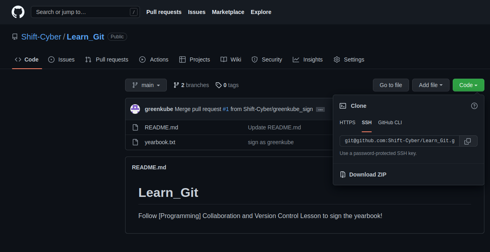
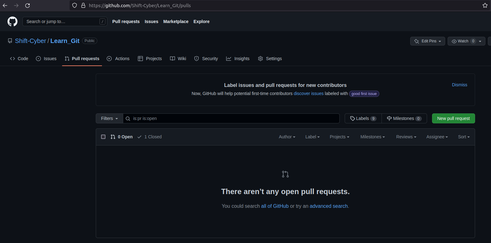
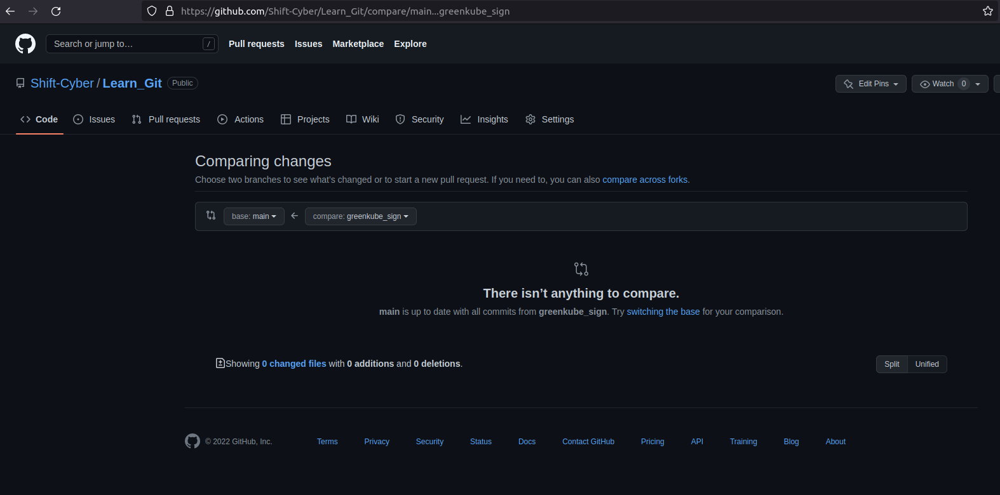
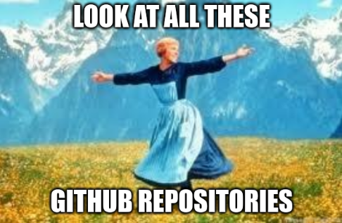

# [Programming] Collaboration and Version Control
Use Git and Github to create software with other developers

# Objectives
* Describe the difference between git and Github
* Use git to clone a repository, make changes, and push your changes
* Use feature branches in git to avoid collisions in work with other developers

# Introduction

If you are ever planning on coding anything useful, you will likely end up working with working with code that other people have written. 

Git and Github are industry standard version control tools that are used for version control. Version control tools offer several functionalities that make it significantly easier to collaborate on writing code:
* Simplify distribution and maintenance of source code
* Track changes made to the code, allowing multiple people to collaborate on the same codebase
* Provide a version history so that changes can be reverted easily if the code is accidentally modified or deleted.

There are many more features with git, but the core functionalities introduced in this lesson will be sufficient to get you started on working with other people's code.

1. [git vs Github](#git-vs-github)
2. [Install git on your computer](#install-git-on-your-computer)
3. [Set up your Github Account](#set-up-your-github-account)
4. [Copy the code to your machine](#copy-the-codebase-to-your-machine)
5. [Make Code Changes](#make-code-changes)
6. [Upload your changes](#upload-your-changes)

# Lesson 
Today's lesson will be hands-on, so get your Linux computer ready and follow along!

## git vs Github
Before we get started, we should clarify the difference between git and Github.

git is the software that provides the version control functionality. It was created by Linus Torvalds, who also is the creator of the Linux kernel.

Github provides servers that host the source code repositories and is powered by git. Github is currently owned by Microsoft and the basic features are free to use for individuals. There are more advanced features, such as source code scanning, 

## Install git on your computer
Assuming you are running on an Ubuntu machine, run the following command in your terminal:

    # Install git
    sudo apt install git

    # Verify that git installed correctly. You should see a version number
    git --version

## Set up your Github Account
Visit https://www.github.com and sign up for an account using your email.

### Set up your SSH keys
In order to securely communicate with Github's servers, you will need to set up your SSH keys. (Look at the SSH lesson for more details).

https://github.com/settings/keys

Follow the instructions to [generate an SSH key](https://docs.github.com/en/authentication/connecting-to-github-with-ssh/generating-a-new-ssh-key-and-adding-it-to-the-ssh-agent) and to [add an SSH key to your account](https://docs.github.com/en/authentication/connecting-to-github-with-ssh/adding-a-new-ssh-key-to-your-github-account). 

## Copy the Codebase to your Machine
### Clone (Download) the repository

We will be working out of Shift Cyber's [Learn_Git repo](https://github.com/Shift-Cyber/Learn_Git) to sign our yearbook in this lesson.

The following command creates a local copy of the git repo on your computer:

    git clone <repo_link>

You can find the repo link in the green `Code` button at the repo's home page. 

Select the `SSH` tab.

You can now run `ls` on your terminal to verify that your code downloaded successfully.

### Update your repository from the remote server

If you are coming back to your computer after some time, it is possible that someone else has already made changes to the remote repository. 

It is good practice to run this command at the beginning of your development session and before pushing any changes:

    # Update your local repository
    git pull

    # Check the status of your git repo
    git status

## Make Code Changes
### Create a new branch
Before you start making changes, it is generally considered best practice to work from a branch instead of the `main` branch. This way, your work won't interfere with other people's development. You can also have your changes reviewed before the changes are merged into the main branch.

To create a new branch, use the following command:

    # Replace <branch_name> with your username
    git checkout -b <branch_name>

In the future, you can omit the `-b` flag to switch to an existing branch

    git checkout main
    git checkout <branch_name>

### Change the code
Using your favorite text editor, try adding your username to `yearbook.txt`. 

Afterwards, run the following command to observe the changes:

    git status

You'll notice that git is tracking the modified files.

## Upload your changes
### Stage your tracked files
Use the following command if you've added new files or modified existing files to your local git repository:

    git add <file_name>

This **stages** your changes so that git will track which changes to the codebase you actually want to add to the repository. 

### Commit your code
**Commits** are changes that will be written to the remote repository. Commits are usually done when you've finished developing a particular feature. You should not commit incomplete code that would result in broken software.

A good commit message is important because it helps other developers understand what changes were made to the code and why. Writing a good commit message is more of an art than a science, but in general, you should attempt to summarize your change and then describe the "why" behind your changes. See [this article](https://cbea.ms/git-commit/) for more details.

Use the following command to commit your changes to the local 
repository.
    git commit -m "<descriptive commit message>"

### Pushing Changes
Once your changes have been successfully committed, you can push your changes to the remote repository:

    # first time pushing
    git push --set-upstream origin <branch_name>

    # future pushes
    git push

Your committed changes should be uploaded to the remote repository.

## Create a pull request
A pull request is a request to the owner of the repository to merge your changes into the main codebase. 

You can create a pull request in GitHub by pressing the `New pull request` button in GitHub.

Select your development branch and request to merge it into the main branch. 

After you create your pull request, someone will review your changes and if approved, they will merge your changes in. 

Congratulations! You are now a contributor to a project!

# Conclusion
Learning Git and Github will give you access to an abundance of incredible projects. Feel free to check out this aptly named [Awesome](https://github.com/sindresorhus/awesome) repo. 

# Glossary
* **Repository (Repo)** - a copy of the codebase
* **Remote** - describes something that is on a server that is not the machine you are currently working on. 
    * For example, a remote repo is a copy of the codebase stored on a server that is not your machine
* **Local** - describes something that is happening on the machine you are currently working on
    * For example, a local repo is a copy of the codebase on your machine
* **Pull** - update the local copy of the codebase
* **Staging** - select which code changes will be a part of a **commit**
* **Commit** - the code changes that actually get saved in the repository
* **Push** - upload and update the remote copy of the codebase with your changes 
* **Branch** - a branch in Git 
* **Origin** - refers to the remote server that the project was cloned from
* **Pull Request** - Request that your branch with your code changes be merged into another branch

---
# Extra Resources
* [git cheat sheet](https://education.github.com/git-cheat-sheet-education.pdf)
* [GitHub Documentation](https://docs.github.com/en)

---
More git - fixing version conflicts

## Fixing version conflicts
    git rebase

## Signing commits

## What is a fork?

## Software Licensing

* Open Source Software - software that is released under a license where the public is able to view, modify, and redistribute the software and its source code.

* **HEAD**  