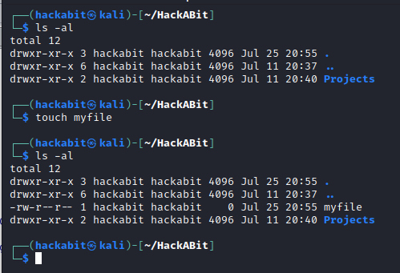
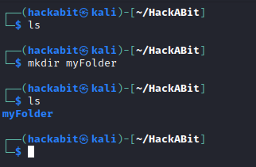
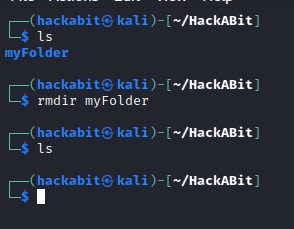
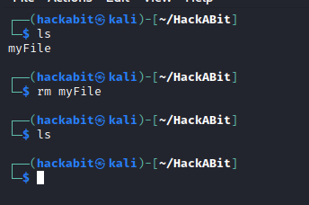
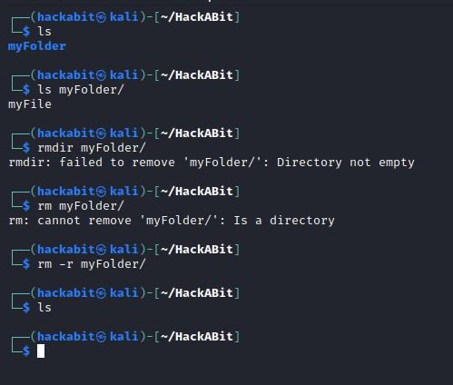
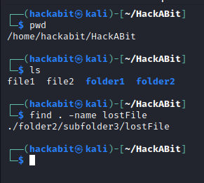
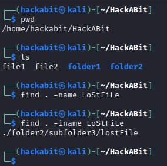
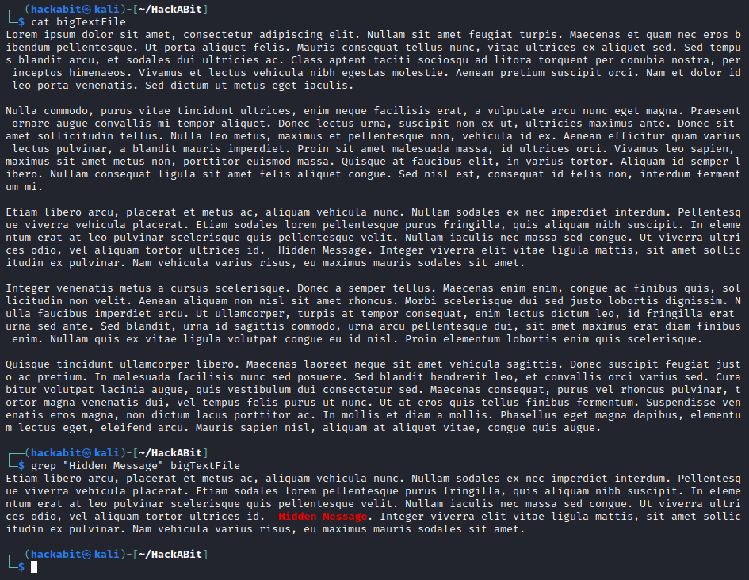
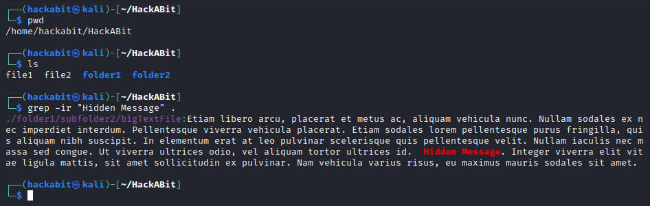
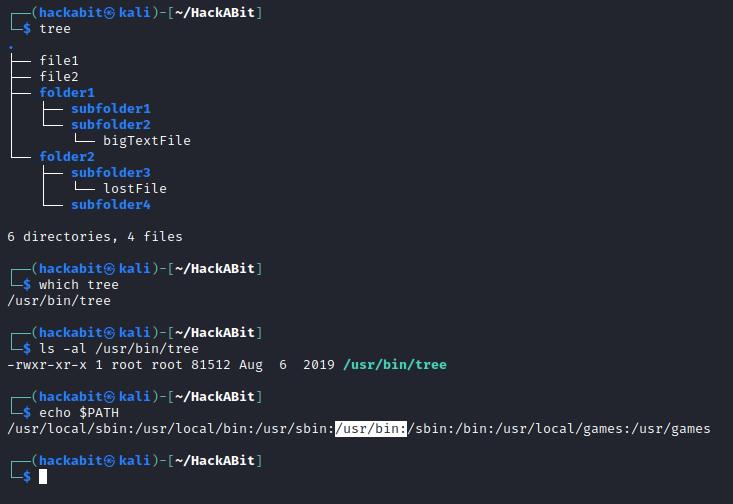

# [System Administration] Linux File System
*What is the Linux file system and to make use of it.*


# Objectives
- Linux default directories: `/`, `/etc/`, `/bin`, `/usr`, `/dev`, `/home`, `/opt`
- Commands to create/remove folders and files: `mkdir`, `rmdir`, `touch`, `rm`
- Commands to search through filenames and file content for something specific: `grep`, `find`

# Introduction
One of the interesting thing about Linux is that just about everything is treated as a file.  You may hear the phrase, 

"On a Linux system, everything is a file; if something is not a file, it is a process."

This even applies to things like directories, which are just files that list other files inside them; hardware drivers, which are `special files` tell the operating system how to interact with physical hardware; and even remote connections, which are represented as files known as `sockets` or `file handles`.

# Lesson
## Section 1
The Linux file system is a tree hierarchy that starts with the folder at the very base of the tree: `/`.  Perhaps somewhat confusingly, this directory is called the `root` directory, not to be confused with the home folder for the `root` user located at `/root`.  In fact the folder `/root` is one of many other folders in the `/` directory.  You can identify these folders because they immediately follow the `/` in an `absolute path`.  A non-comprehensive list and short description of these folders that you find on almost every major Linux distribution are as follows:  
  
```
/home - User home directories (and user configuration files) are kept here.
/etc  - Contains a wide amount of configuration files for the operating system.
/bin  - Contains most binaries (programs) that are deemed critical for the system to operate.
/usr  -	Binaries/programs for users (as opposed to the system) are in here.  Usually read-only.
/opt  - Optional or add-on programs and software packages.
/var  - Variable data files, such as logs and web pages.
/dev  - Device files that are use to interact with physical hardware.
/tmp  - Temporary files.  The system usually deletes everything in this folder when it is restarted.
```

Remember this is not a complete list of all the Linux directories you might see.  It's not even required that directories be used the way they are described here, but it is common that they be used this way.

## Section 2
How about if we want to create some of our own files?  Well the simplest way to do that is to use the command, `touch`.  `touch` simply creates an empty file with the name that you supply after the command, like such:  

<br>
*Remember from the Linux Navigation module that `ls -al` lists all of the files and folders in a directory in long format.*


How about creating a folder?  This can easily be done using `mkdir` which means "make directory":



Removing a directory can be done using the `rmdir` command, short for "remove directory."  However, this can only be used for empty directories:



Finally, removing files can be done with the command `rm.`



Now consider for a minute how you might remove a directory with many files and sub-directories in it.  Since `rmdir` only works on empty directories, you might think that you would have to individually remove every single file in each sub-directory, then remove the sub-directory, and then repeat until everything is gone.  Fortunately, things don't have to be that tedious.  

The `rm` command is also capable of removing directories and sub-directories and all the files in them in one fell swoop.  This is done using the "-r" flag, which stands for "recursive."  Don't worry if you don't understand what that word means just yet though.  



As seen here, you may get a prompt asking if you're sure you would like to remove a particular file or not.  You can just type `y` or `n` and then press enter to make your decision.

## Section 3
Now we know how to create and remove files and folders, next we need to be able to look through the file system quickly to locate specific files or text.  The two programs we'll explore for this are `find` and `grep`.

`find` is a very powerful program that allows you to search on different criteria such as name, file type, last modified time, permissions, and more.  In this module, we'll focus simply on searching for a file by name.  This can be done using `find` with the `-name` flag like so:



It's important to remember that `find` is case-sensitive by default when searching for files.  If you want the program to ignore case, you can use the `-i` flag together with `name`.



How about if you want to search the *content* of a file for a particular string of text?  For that we can use `grep`.  `grep` is also a very powerful program with many use-cases.  We can use it to look for the text "ThisIsTheTextToFind" in the file LookHere.txt as follows:



It's important to know that unlike `find`, `grep` doesn't search sub-directories by default.  In fact it's only going to search the filename that you give it.  If you want it to search many files at once in a director, you can use the `-r` command (again short for recursive) on the directory to search everything in it.  You can also use `-i` to search *insensitive* of case.



# The Real World, Prolific Breaches
Although all distributions of Linux are different in some way, there are reasons that the general structure of the Linux file system is standardized.  One example of this is the default location for programs.  Consider that all of the commands learned here and in previous modules are actually just programs.  `ls`, `mkdir`, `touch`, etc. are programs kept in default directories (either `/bin` or `/usr/bin`) on the file system.  If they *weren't* in those locations, how would you look for them without `ls`?  It would be quite difficult!  For this reason, most Linux distributions keep a list of the usual places to look for binaries/programs, and this list is called the `path`.  Any program that is stored in a directory listed in `path` can be called simply by typing the name of the program on the command line.



# Check YoSelf
## Q1 - Which directory would you look in to find configuration files for the operating system?
a. `/usr`<br>
b. `/etc` <---<br>
c. `/var`<br>
d. `/dev`<br>

## Q2 - Which command can be used to remove a directory if there are files inside it?
a. `rmdir`<br>
b. `rm`<br>
c. `delete`<br>
d. `rm -r`<---<br>

## Q3 - Using the `grep` command with no flags will look in sub-directories by default.
a. `true`<br>
b. `false` <---<br>


# Keep Going, Next Steps
Check out the following curated resources if you'd like to keep learning about this topic to dominate hard challenges.
1. Linux File Hierarchy Structure - https://www.geeksforgeeks.org/linux-file-hierarchy-structure/
2. Linux Directory Structure - https://www.geeksforgeeks.org/linux-directory-structure/
3. Linux Directory Structure Explained for Beginners - https://linuxhandbook.com/linux-directory-structure/
4. PLACEHOLDER_FOR_YOUTUBE - PLACEHOLDER_FOR_YOUTUBE